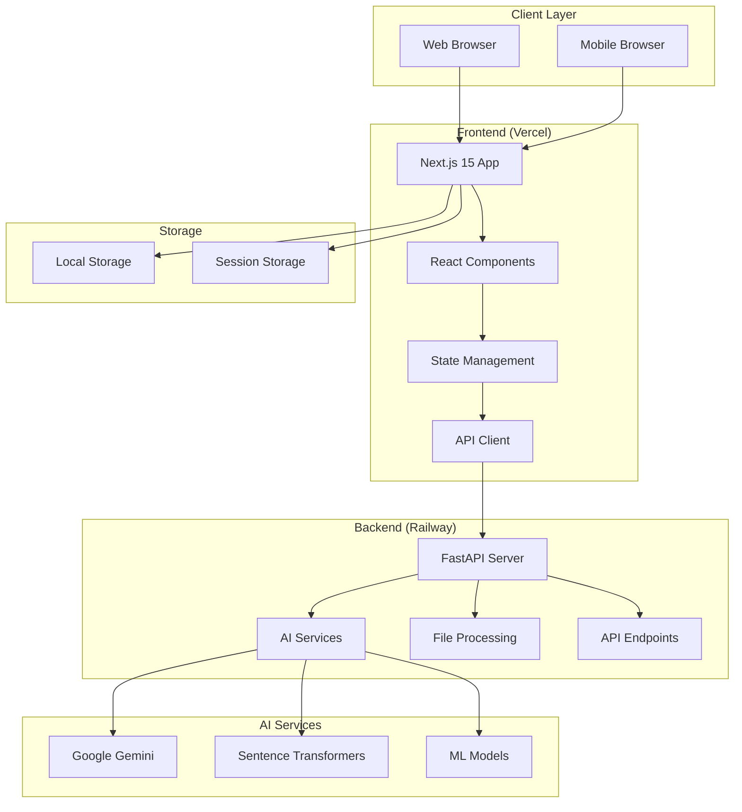
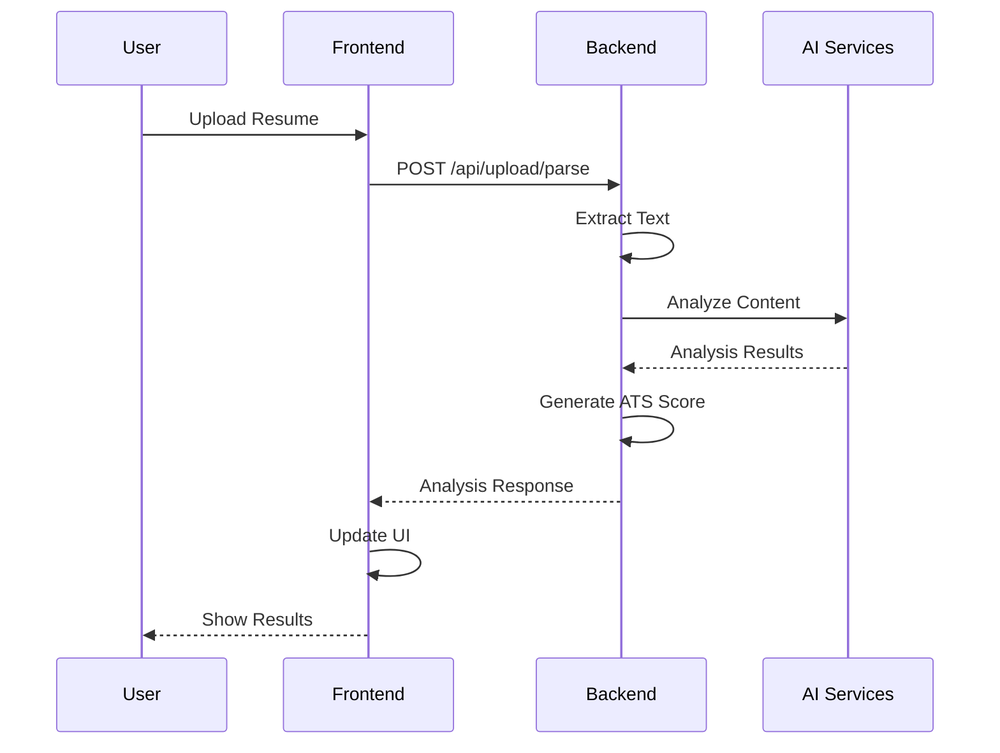
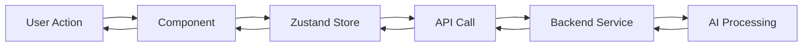

# 🏗️ System Architecture

Comprehensive overview of the Bhuvesh Portfolio system architecture, design decisions, and technical implementation.

## 🎯 System Overview

The Bhuvesh Portfolio is a full-stack web application consisting of:

- **Frontend**: Next.js 15 React application with TypeScript
- **Backend**: FastAPI Python application with AI capabilities
- **AI Services**: Google Gemini and Sentence Transformers integration
- **Deployment**: Vercel (frontend) and Railway (backend)

## 🏛️ High-Level Architecture



## 🎨 Frontend Architecture

### Technology Stack

- **Framework**: Next.js 15 with App Router
- **Language**: TypeScript with strict type checking
- **Styling**: Tailwind CSS with custom theme system
- **State Management**: Zustand with TypeScript
- **Animations**: Framer Motion
- **Build Tool**: Turbopack

### Component Architecture

#### Atomic Design Pattern

```
components/
├── atoms/              # Basic UI elements
│   ├── Button/
│   ├── Input/
│   └── Icon/
├── molecules/          # Composite components
│   ├── FormField/
│   ├── StatusBadge/
│   └── FileUpload/
├── organisms/          # Complex components
│   ├── ATSChecker/
│   ├── ResumeBuilder/
│   └── FloatingPanel/
└── ui/                 # Reusable UI components
    ├── Modal/
    ├── Tooltip/
    └── Loading/
```

#### State Management

- **Zustand Stores**: Centralized state management
- **React Context**: Theme and user preferences
- **Local Storage**: Persistent data storage
- **Session Storage**: Temporary data storage

### Key Frontend Features

#### 1. Resume Management System

- **Multi-resume Support**: Save and organize multiple resume versions
- **Version Control**: Track changes and revisions
- **Comparison Tools**: Compare different resume versions
- **ATS Analysis**: Real-time ATS scoring and feedback

#### 2. AI Integration

- **Job Detection**: AI-powered job type identification
- **Content Analysis**: Semantic analysis of resume content
- **Improvement Suggestions**: AI-generated recommendations
- **Real-time Feedback**: Interactive analysis results

#### 3. User Experience

- **Responsive Design**: Mobile-first approach
- **Dark Theme**: System preference detection
- **Smooth Animations**: Framer Motion transitions
- **Accessibility**: WCAG 2.1 AA compliance

## 🔧 Backend Architecture

### Technology Stack

- **Framework**: FastAPI with Python 3.9+
- **AI/ML**: Google Gemini, Sentence Transformers
- **File Processing**: PyMuPDF, python-docx
- **Validation**: Pydantic with type hints
- **Deployment**: Railway with auto-scaling

### Service Architecture

#### Core Services

```python
app/
├── core/                    # Core configuration
│   ├── ai_config.py        # Centralized AI configuration
│   └── error_handling.py   # Error handling utilities
├── services/               # Business logic services
│   ├── ats_analyzer.py     # ATS analysis engine
│   ├── job_detector.py     # Job type detection
│   ├── resume_improver.py  # Resume improvement suggestions
│   ├── project_extractor.py # Work experience extraction
│   └── job_description_generator.py # Job description generation
├── api/                    # API endpoints
│   └── upload.py          # File upload and analysis
└── utils/                  # Utility functions
```

#### AI Integration

- **Centralized Configuration**: Single point for AI model management
- **Error Handling**: Graceful fallbacks when AI services are unavailable
- **Caching**: Model caching for improved performance
- **Monitoring**: Health checks and performance tracking

### Key Backend Features

#### 1. ATS Analysis Engine

- **Semantic Matching**: Beyond keyword matching using embeddings
- **Multi-dimensional Scoring**: Comprehensive ATS compatibility analysis
- **Industry Standards**: Based on ATS industry best practices
- **Real-time Processing**: Fast analysis with caching

#### 2. File Processing

- **Multi-format Support**: PDF, DOCX, DOC, TXT files
- **Text Extraction**: High-quality text extraction from various formats
- **Error Handling**: Robust error handling for corrupted files
- **Validation**: File type and size validation

#### 3. API Design

- **RESTful APIs**: Clean, consistent API design
- **OpenAPI Documentation**: Auto-generated API documentation
- **Type Safety**: Full Pydantic validation
- **Error Responses**: Standardized error response format

## 🔄 Data Flow

### Resume Analysis Flow



### State Management Flow



## 🚀 Deployment Architecture

### Frontend (Vercel)

- **CDN**: Global content delivery network
- **Edge Functions**: Serverless functions at the edge
- **Automatic Scaling**: Handles traffic spikes automatically
- **Preview Deployments**: Automatic preview for pull requests

### Backend (Railway)

- **Containerized**: Docker-based deployment
- **Auto-scaling**: Automatic scaling based on demand
- **Health Monitoring**: Built-in health checks
- **Log Management**: Centralized logging and monitoring

### Environment Configuration

- **Development**: Local development with hot reload
- **Staging**: Preview deployments for testing
- **Production**: Optimized for performance and reliability

## 🔒 Security Architecture

### Frontend Security

- **Content Security Policy**: XSS protection
- **HTTPS Only**: Secure communication
- **Input Validation**: Client-side validation
- **Error Handling**: Secure error messages

### Backend Security

- **CORS Configuration**: Controlled cross-origin requests
- **Input Validation**: Pydantic model validation
- **File Upload Security**: File type and size validation
- **API Rate Limiting**: Protection against abuse

## 📊 Performance Architecture

### Frontend Performance

- **Code Splitting**: Lazy loading of components
- **Image Optimization**: Next.js automatic image optimization
- **Caching**: Browser and CDN caching
- **Bundle Optimization**: Tree shaking and minification

### Backend Performance

- **Model Caching**: AI model caching for faster responses
- **Connection Pooling**: Database connection optimization
- **Async Processing**: Non-blocking I/O operations
- **Response Compression**: Gzip compression for API responses

## 🔍 Monitoring & Observability

### Frontend Monitoring

- **Error Tracking**: Client-side error monitoring
- **Performance Metrics**: Core Web Vitals tracking
- **User Analytics**: Usage analytics and insights
- **A/B Testing**: Feature flag management

### Backend Monitoring

- **Health Checks**: Service health monitoring
- **Logging**: Structured logging with levels
- **Metrics**: Performance and usage metrics
- **Alerting**: Automated alerting for issues

## 🧪 Testing Architecture

### Frontend Testing

- **Unit Tests**: Jest and React Testing Library
- **Integration Tests**: Component integration testing
- **E2E Tests**: Cypress for end-to-end testing
- **Visual Regression**: Screenshot testing

### Backend Testing

- **Unit Tests**: Pytest for individual functions
- **Integration Tests**: API endpoint testing
- **Mock Testing**: AI service mocking
- **Performance Tests**: Load testing

## 🔮 Future Architecture Considerations

### Scalability

- **Microservices**: Potential migration to microservices
- **Database**: PostgreSQL for persistent storage
- **Caching**: Redis for distributed caching
- **Queue System**: Celery for background tasks

### AI Enhancements

- **Model Versioning**: A/B testing of AI models
- **Custom Models**: Fine-tuned models for specific domains
- **Real-time Processing**: WebSocket for real-time updates
- **Batch Processing**: Bulk analysis capabilities

---

**Last Updated**: December 2024  
**Maintainer**: Bhuvesh Singla
